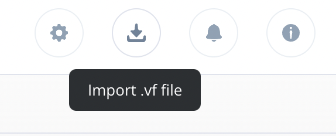
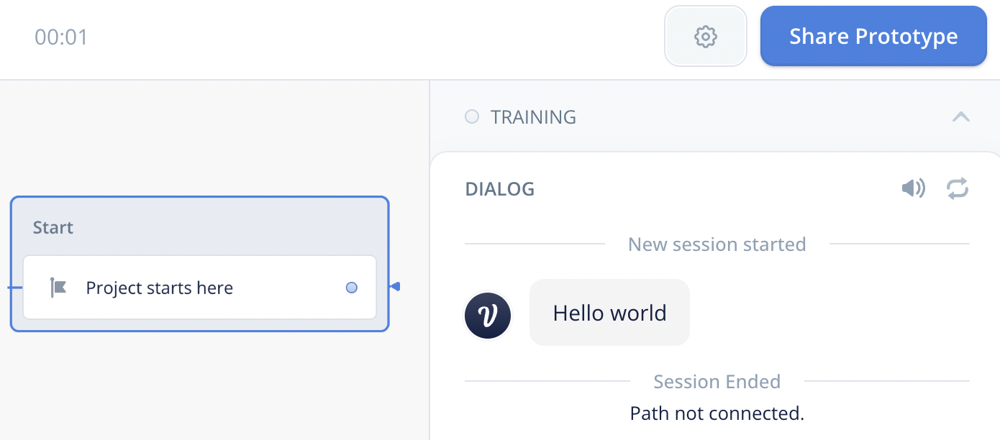

# Getting Started

## Installation

Install from package or from source. Packages for various platforms are coming soon...

## Hello World Conversation

Let's compile a basic hello world conversation. The most basic flowdown file is
just a single utterance.
```
$ echo 'Hello world' > hello.fd
$ fdc -o hello.vf hello.fd
```

## Import to Voiceflow

To be able to run the compiled voiceflow conversation, you will need an account
on the [voiceflow platform](https://creator.voiceflow.com/signup).

Once you are setup, navigate to your dashboard and locate the import button on
the top right corner.



Select and upload the compiled `hello.vf` file, and you should see the project
appear in your dashboard. Running our project, we get our first compiled
conversation!


